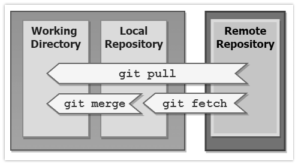

# GIT GUIDE

### Setup git

1. Check if there is .git folder by `ls -a`
2. If there is already a .git in the directory, delete it by `rm -rf .git`
3. Configuring .gitignore file: (if you don't see one, you can create it)
	- Add files you don't want to upload to git repository. If there is forward slash in front of it, just remove it.
   For example: `/filename` this is a comment in .gitignore file which means it WILL upload that file

---
  
### Initialize git

- Initialize git repository with `git init`

---

### Add - Add changes in current directory to staging area

- `git add .` (add all)

---

### Commit - Capture a snapshot of staged files

- `git commit -m 'commit message'`

---

### Create remote git repo - If you haven't created your remote git repo, follow these steps

1. Go to GitHub website
2. New repository
3. Repository name
4. Set Public/Private
5. Click on Create repository button

---

### Push - Upload changes from local git repo to remote git repo

1. `git remote add origin https://github.com/your-github-name/remote-repo.git` (replace your-github-name and remote-repo accordingly)
2. `git branch -M main`
3. `git push -u origin main`

---

### Clone - Get clone of remote repo (when you are collaborating with others)

1. Go to GitHub and click on the repo
2. Click on Code with a green button
3. Copy the link which ends with .git
4. Open terminal and go to the directory where you want to save the clone
5. use `git clone remote-repo-url.git`

---

### Fetch

1. `git fetch` to download new update from online git repo to the local git repo (NOT to the working tree/directory)
2. `git merge` to merge new update with the working tree

---

### Pull

- `git pull` runs both above commands (git fetch, git merge)
  

---

### Stash - Stash any changes that haven't been committed

Stash changes

1. Make some changes
2. `git add .` (add changes to stage)
2. `git stash` or `git stash push` to stash changes that haven't been committed

Pop - Bring back old changes from stash

- `git stash pop` or `git stash apply` (similar to pop, but pop will remove the item from stash)

List - Check all items in the stash

- `git stash list` (on Mac, to quit current window, press "Q")

Clear - Clear items in the stash

- `git stash clear`

In case you want to stash un-tracked changes, you need to use -u (un-tracked)

- `git stash -u`

---

### Handling Merge Conflict with Stash

In a scenario where you made some changes and at the same time another collaborator made also changes in the same file as well

1. `git add .` (first add your changes in staging area)
2. `git stash -m "my changes"` (stash your changes)
3. `git pull` (get changes of other collaborators)
4. `git stash pop` (bring back your changes from stash. This will merge two files and will show both changes in same file)
5. now you can open that file and make your decision. For example which changes you want to keep or remove and save the file
6. `git add .` (add merged file to the staging area)
7. `git commit -m "commit message"`
8. `git push`

---

### Steps to push updated files

1. `git pull` (when you collaborate with others, always first pull updated files)
2. Make some changes
3. `git add .` (add changes to stage)
4. `git commit -m 'Your message'`
5. `git push`

by khen